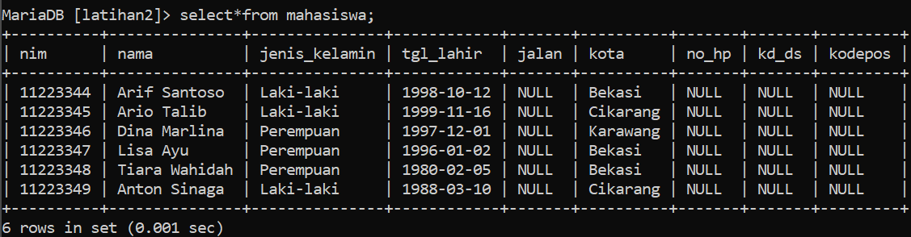
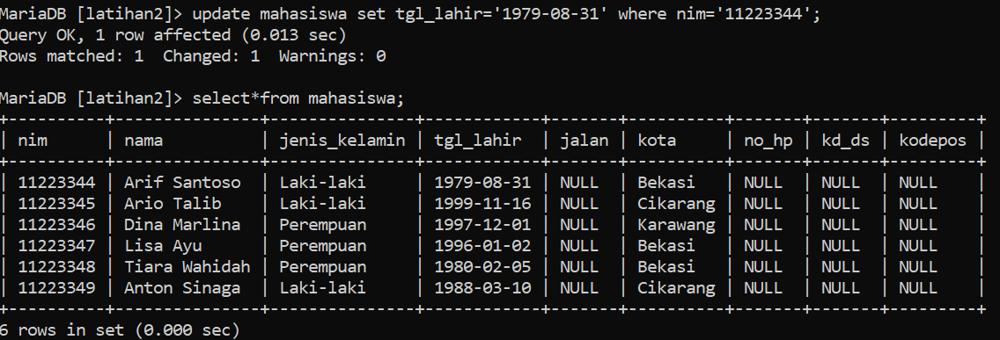
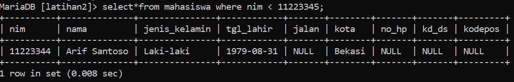
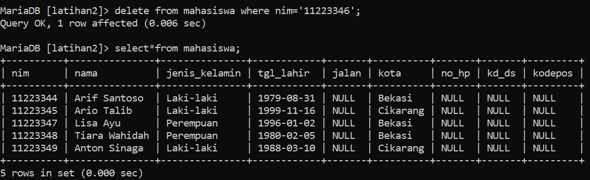
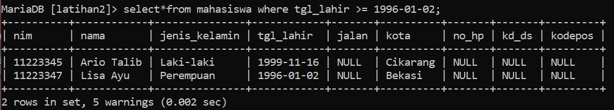
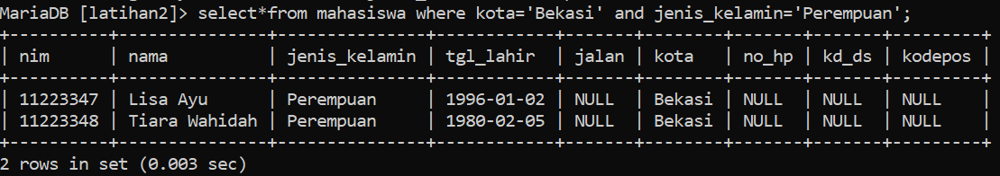
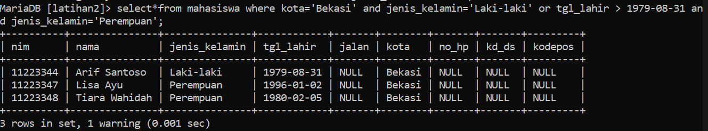
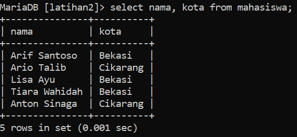
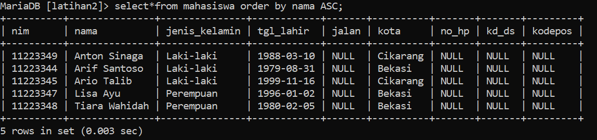

# **Tugas Praktikum**
## **Praktikum 1**
ada di dokumen
## **Praktikum 2**
1. Tampilkan semua isi /record tabel !

`select*from mahasiswa;`

2. Ubah data tanggal lahir mahasiswa yang bernama Ari menjadi : 1979-08-31!

`update mahasiswa set tgl_lahir='1979-08-31' where nim ='11223344':`

3. Tampilkan satu baris / record data yang telah diubah tadi yaitu record dengan nama Ari saja !

`select*from mahasiswa where nim < 11223345;`

4. Hapus Mahasiswa yang bernama Dina!

`delete from mahasiswa where nim='11223346';`

5. Tampilkan record atau data yang tanggal kelahirannya lebih dari atau sama dengan 1996-1-2!

`select*from mahasiswa where tgl_lahir >= 1996-01-02;`

6. Tampilkan semua Mahasiswa yang berasal dari Bekasi dan berjenis kelamin perempuan !

`select*from mahasiswa where kota='Bekasi' and jenis_kelamin='Perempuan';`

7. Tampilkan semua Mahasiswa yang berasal dari Bekasi dengan kelamin laki laki atau Mahasiswa yang berumur lebih dari 22 tahun dengan kelamin wanita

`select*from mahasiswa where kota='Bekasi' and jenis_kelamin='Laki-laki' or tgl_lahir > 1979-08-31 and jenis_kelamin='Perempuan'`

8. Tampilkan data nama dan alamat mahasiswa saja dari tabel tersebut

`select nama, kota from mahasiswa;`

9. Tampilkan data mahasiswa terurut berdasarkan nama

`select*from mahasiswa order by nama ASC;`

## **Evaluasi dan Pertanyaan**
1. Apa bedanya penggunaan BETWEEN dan penggunaan operator >=
dan <= ?
- (misal : tgl_lahir BETWEEN '1990-10-10' AND '1992-10-11')
- (misal : tgl_lahir >= '1990-10-10' AND tgl_lahir <= '1992-10-11')
1. Kedua pernyataan tersebut memiliki makna yang sama, yaitu mencari data yang memiliki nilai tanggal lahir antara '1990-10-10' dan '1992-10-11'. Perbedaannya hanya terletak pada sintaksis penggunaannya. Penggunaan BETWEEN lebih mudah dibaca dan ditulis, sedangkan penggunaan operator >= dan <= lebih fleksibel karena dapat digunakan untuk membandingkan nilai selain tanggal.